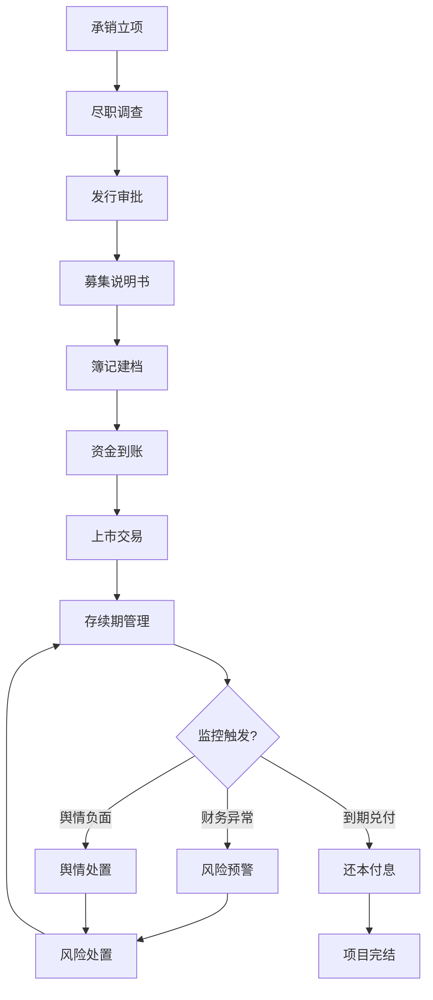
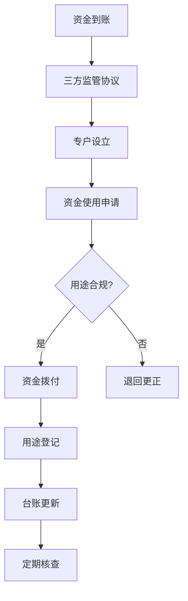

# 债券发行与存续期合规管理平台 PRD

## 1. 产品概述

债券发行与存续期合规管理平台是一个面向债券承销商、发行人和合规管理人员的全流程管理系统，覆盖债券从承销立项、发行上市到存续期管理的完整生命周期。
- 核心解决债券业务中的募集资金监管、财务指标监控、舆情预警和合规风险管控问题
- 目标用户：券商投行部、债券承销团队、合规风控人员、发行人财务管理人员

## 2. 核心功能

### 2.1 用户角色
| 角色 | 注册方式 | 核心权限 |
|------|----------|----------|
| 合规管理员 | 系统预设 | 全模块访问、风险处置、报表导出 |
| 承销经理 | 系统预设 | 债券项目管理、发行进度跟踪 |
| 风控人员 | 系统预设 | 财务指标监控、舆情查看、预警处理 |
| 发行人用户 | 系统预设 | 信息披露、募集资金使用报备 |

### 2.2 功能模块
1. **工作台总览**：数据看板、关键指标、待办事项、风险预警
2. **债券项目管理**：承销立项、发行审批、上市管理、债券档案
3. **募集资金追踪**：资金到账、用途登记、使用监控、专户管理
4. **财务监控中心**：财务指标看板、阈值预警、趋势分析、财报管理
5. **舆情监控中心**：舆情列表、情感分析、热点追踪、预警设置
6. **存续期管理**：付息兑付、信息披露、持有人会议、违约处置
7. **合规报告**：合规检查、报告生成、监管报送、档案管理

### 2.3 页面详情

| 页面名称 | 模块名称 | 功能描述 |
|----------|----------|----------|
| 工作台总览 | 数据概览卡片 | 显示在管债券数量、募集资金总额、预警数量、本月到期等核心指标 |
| 工作台总览 | 风险预警区 | 展示高/中/低风险预警事项，支持快速处置 |
| 工作台总览 | 待办任务 | 按优先级展示待审批、待披露、待回复事项 |
| 工作台总览 | 资金使用趋势图 | 展示募集资金使用进度的柱状/折线图 |
| 债券项目管理 | 项目列表 | 支持按状态、类型、时间筛选债券项目 |
| 债券项目管理 | 项目详情 | 展示债券基本信息、承销进度、发行时间表 |
| 债券项目管理 | 流程审批 | 可视化展示承销发行审批流程节点 |
| 募集资金追踪 | 资金到账登记 | 记录募集资金到账时间、金额、账户信息 |
| 募集资金追踪 | 用途明细 | 逐笔登记资金使用情况，关联约定用途 |
| 募集资金追踪 | 使用合规校验 | 自动比对实际用途与募集说明书约定用途 |
| 募集资金追踪 | 专户流水 | 展示募集资金专户的资金流水明细 |
| 财务监控中心 | 指标看板 | 展示资产负债率、流动比率、速动比率等关键财务指标 |
| 财务监控中心 | 预警阈值配置 | 设置各财务指标的预警线和处置线 |
| 财务监控中心 | 趋势分析图 | 多期财务数据对比，展示指标变化趋势 |
| 财务监控中心 | 财报上传 | 支持定期报告、临时报告的上传与归档 |
| 舆情监控中心 | 舆情列表 | 按时间、来源、情感倾向展示舆情信息 |
| 舆情监控中心 | 舆情详情 | 展示舆情内容、来源、传播路径、情感分析 |
| 舆情监控中心 | 预警设置 | 配置关键词、敏感词、预警级别 |
| 舆情监控中心 | 舆情统计 | 舆情数量趋势、情感分布、来源分布图表 |
| 存续期管理 | 付息兑付日历 | 日历视图展示未来付息、兑付、行权事项 |
| 存续期管理 | 信息披露 | 披露事项登记、披露文件管理、披露时限提醒 |
| 存续期管理 | 违约处置 | 违约事件登记、处置流程跟踪、处置进展记录 |
| 合规报告 | 合规检查表 | 定期合规检查项，支持勾选确认和问题记录 |
| 合规报告 | 报告生成 | 自动生成存续期合规报告、年度风险管理报告 |
| 合规报告 | 监管报送 | 跟踪监管报送事项、报送状态、回执管理 |

## 3. 核心流程

### 债券发行与存续期管理主流程

### 募集资金监管流程

## 4. 用户界面设计

### 4.1 设计风格
- **主色调**：深海蓝 (#0A2463) - 体现金融行业的专业、稳重、可信赖
- **辅助色**：香槟金 (#D8B44A) - 用于强调和重要数据展示
- **预警色**：红色 (#E63946) 表示高风险，橙色 (#F77F00) 表示中风险，绿色 (#2A9D8F) 表示正常
- **字体**：标题使用"思源宋体"或"Noto Serif SC"，正文使用"思源黑体"或"Noto Sans SC"
- **按钮样式**：圆角矩形（6px），主按钮深蓝底白字，次按钮白底深蓝字带边框
- **布局风格**：左侧固定导航栏 + 顶部面包屑 + 主内容区，卡片式布局
- **图标风格**：使用Lucide图标库，线性风格，统一2px描边

### 4.2 页面设计概览

| 页面名称 | 模块名称 | UI元素 |
|----------|----------|--------|
| 工作台总览 | 数据卡片 | 渐变背景卡片，大号数字显示，hover轻微上浮效果 |
| 工作台总览 | 预警区 | 红/橙/绿标签区分风险等级，时间线样式展示 |
| 债券管理 | 列表页 | 表格布局，状态标签彩色区分，搜索筛选栏置顶 |
| 债券管理 | 详情页 | 顶部债券信息卡，下方Tab切换不同信息模块 |
| 资金追踪 | 看板 | 进度条可视化资金使用比例，彩色标签标记用途类别 |
| 财务监控 | 图表区 | ECharts图表，深色背景网格线，金色高亮关键数据点 |
| 舆情监控 | 信息流 | 卡片式信息流，来源标签，情感倾向色条标识 |
| 存续期 | 日历视图 | 月历视图，日期上标记事件点，点击展开详情 |

### 4.3 响应式设计
- 桌面端优先设计（1920px及以上）
- 适配中等屏幕（1366px-1920px）：调整卡片间距和图表尺寸
- 平板适配（768px-1366px）：侧边栏可折叠，图表自适应宽度
- 移动端：暂不做完整适配，核心数据可查看

### 4.4 交互效果
- 页面加载时卡片依次淡入动画
- 数据变化时数字滚动效果
- Hover状态：按钮、卡片、表格行都有明确反馈
- 预警事项闪烁提醒效果
- 图表加载时的骨架屏效果
