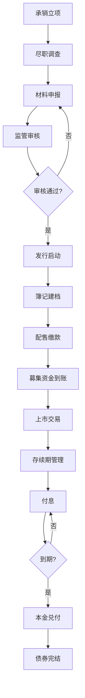
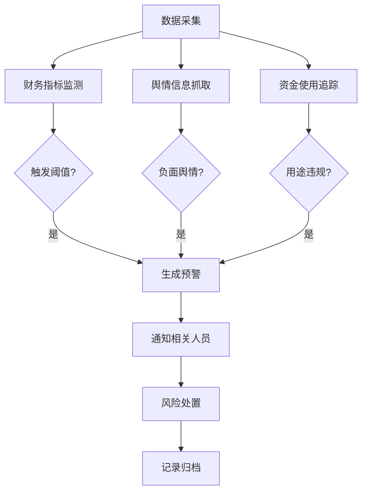

## 1. 产品概述

债券发行与存续期合规管理平台是面向券商、基金公司、债券发行人等金融机构的专业合规管理系统。
- 覆盖债券从承销、发行到存续期的完整生命周期管理，实现募集资金用途追踪、财务指标自动监控、舆情动态实时预警
- 帮助机构合规人员高效管理债券业务，降低合规风险，提升监管报送效率

## 2. 核心功能

### 2.1 用户角色
| 角色 | 注册方式 | 核心权限 |
|------|----------|----------|
| 合规管理员 | 系统预设 | 全功能访问，债券全生命周期管理，合规审核 |
| 承销人员 | 系统预设 | 债券承销信息录入，发行进度跟踪 |
| 风控人员 | 系统预设 | 财务指标监控，舆情预警查看，风险报告 |
| 高管视图 | 系统预设 | 数据看板，统计报表，风险概览 |

### 2.2 功能模块
1. **工作台首页**：数据概览看板，待办事项，风险预警，快捷入口
2. **债券承销管理**：承销项目列表，项目详情，尽职调查，材料申报
3. **债券发行管理**：发行信息登记，发行进度跟踪，募集资金到账
4. **存续期管理**：债券列表，付息兑付，信息披露，持有人会议
5. **募集资金追踪**：资金使用计划，实际使用台账，用途变更审批，专户管理
6. **财务监控中心**：发行人财务指标录入，阈值预警，指标趋势分析，合规检查
7. **舆情监控中心**：舆情动态列表，舆情详情，风险等级标记，预警通知
8. **系统设置**：指标配置，预警规则，用户管理（mock）

### 2.3 页面详情
| 页面名称 | 模块名称 | 功能描述 |
|----------|----------|----------|
| 工作台首页 | 数据概览看板 | 展示债券总数、在发项目、预警数量、募集资金总额等关键指标卡片 |
| 工作台首页 | 待办事项 | 承销待审核、发行待批复、付息提醒、舆情待处理等任务列表 |
| 工作台首页 | 风险预警 | 财务指标异常、舆情负面信息、资金用途异常等预警条目 |
| 债券承销管理 | 项目列表 | 展示承销项目列表，支持按状态、债券类型筛选，支持新增项目 |
| 债券承销管理 | 项目详情 | 项目基本信息、尽职调查、申报材料、进度时间线 |
| 债券发行管理 | 发行列表 | 展示发行中债券列表，发行状态，进度条展示 |
| 债券发行管理 | 发行详情 | 发行条款、簿记建档、配售结果、募集资金到账登记 |
| 存续期管理 | 债券列表 | 存续期债券列表，剩余期限，付息日，到期日提醒 |
| 存续期管理 | 债券详情 | 基本信息、付息兑付记录、信息披露记录、重大事项 |
| 募集资金追踪 | 资金总览 | 募集总额、已使用金额、剩余金额、用途分类统计 |
| 募集资金追踪 | 使用台账 | 资金使用明细记录，支持按项目、时间筛选 |
| 募集资金追踪 | 用途变更 | 用途变更申请记录，审批流程跟踪 |
| 财务监控中心 | 指标总览 | 关键财务指标看板：资产负债率、流动比率、净利润率等 |
| 财务监控中心 | 预警列表 | 触发预警阈值的指标列表，预警等级，处理状态 |
| 财务监控中心 | 趋势分析 | 财务指标历史趋势图表展示 |
| 舆情监控中心 | 舆情列表 | 舆情新闻列表，来源，时间，情感倾向，风险等级 |
| 舆情监控中心 | 舆情详情 | 舆情内容详情，关联债券，影响分析，处理记录 |

## 3. 核心流程

### 3.1 债券全生命周期管理流程

债券从承销立项到到期兑付的完整流程：

### 3.2 合规监控流程

## 4. 用户界面设计

### 4.1 设计风格
- **主色调**：深蓝色系（#1e3a8a 作为主色，象征金融专业稳健），配合金色点缀（#d97706）
- **辅助色**：成功绿色（#059669）、警告橙色（#d97706）、危险红色（#dc2626）、信息蓝色（#0284c7）
- **按钮风格**：圆角适中（6px），主按钮渐变深蓝，次按钮边框样式，hover 有微动画
- **字体选择**：标题使用思源宋体（衬线体体现金融专业感），正文使用系统默认无衬线字体
- **布局风格**：左侧固定导航 + 顶部状态栏 + 主内容区，卡片式布局，数据表格专业清晰
- **图标风格**：使用 Lucide React 线性图标，简洁专业，金融相关图标使用实心风格增强识别度

### 4.2 页面设计概览
| 页面名称 | 模块名称 | UI 元素 |
|----------|----------|---------|
| 工作台首页 | 数据概览看板 | 深色渐变统计卡片，数字加粗突出，环比/同比箭头指示，悬浮微上移动画 |
| 工作台首页 | 待办事项 | 时间线样式列表，红色圆点标注紧急事项，右侧快捷操作按钮 |
| 工作台首页 | 风险预警 | 红黄蓝三色预警等级标签，预警类型图标，时间排序 |
| 债券列表页 | 筛选栏 | 顶部搜索框 + 状态筛选标签 + 债券类型下拉，紧凑排布 |
| 债券列表页 | 数据表格 | 斑马纹表格，行 hover 高亮，状态标签颜色区分，操作按钮组 |
| 详情页 | 信息卡片 | 分区卡片布局，标题栏左侧彩色竖条标识分区，关键信息加粗 |
| 详情页 | 时间线 | 垂直时间线展示进度，已完成节点实心圆点带对勾，当前节点蓝色脉冲动画 |
| 图表页 | 数据图表 | 使用 Recharts 绘制折线图/柱状图/饼图，深色网格线，数据点 tooltip 丰富 |
| 表单页 | 表单组件 | 标签左对齐，必填项星号标识，输入框聚焦边框高亮，提交按钮固定底部 |

### 4.3 响应式设计
- 桌面端优先设计（1440px 及以上）
- 适配 1280px 笔记本屏幕，导航可折叠
- 平板端（768px-1024px）布局自动调整，表格横向滚动
- 暂不做移动端深度适配，保证基础可访问

### 4.4 交互体验
- 页面切换使用淡入淡出过渡
- 数据加载使用骨架屏而非简单 loading
- 操作成功/失败使用右上角 toast 提示
- 关键操作（如删除）需二次确认弹窗
- 表格支持列排序，数据量大时分页展示
