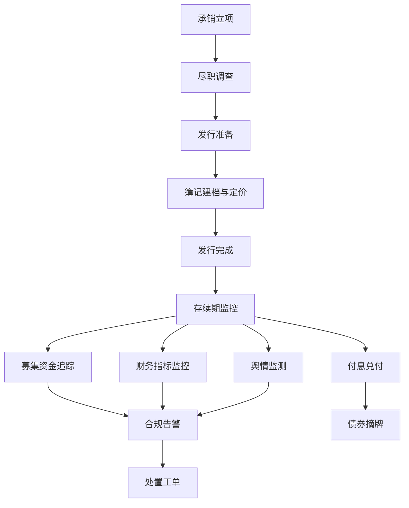

# 债券发行与存续期合规管理平台 - 产品需求文档

## 1. 产品概述
本产品是一款面向证券公司、金融机构与债券发行人的债券全生命周期合规管理平台，覆盖承销立项、发行执行、存续期管理、募集资金用途追踪、发行人财务指标监控与舆情动态预警等关键环节。
平台旨在通过数字化与智能化手段提升债券业务的合规效率、降低操作风险，目标用户为承销商投行部、风险控制部、合规部及债券业务管理人员。

## 2. 核心功能

### 2.1 用户角色
| 角色 | 注册方式 | 核心权限 |
|------|----------|----------|
| 承销经理 | 工号登录 | 创建/管理承销项目、发行执行、查看存续期数据 |
| 风控合规专员 | 工号登录 | 审阅项目合规、查看监控预警、处理舆情事件 |
| 业务管理员 | 工号登录 | 全平台数据查看、规则配置、用户权限管理 |

### 2.2 功能模块
1. **驾驶舱首页**：核心指标卡片、债券组合概览、风险预警列表、待办事项、合规健康度仪表
2. **承销管理**：项目立项、尽职调查、承销团成员、文档管理、流程节点
3. **发行管理**：发行计划、簿记建档、定价信息、发行结果、批文管理
4. **存续期管理**：债券台账、付息兑付安排、信息披露日历、持有人会议记录
5. **募集资金追踪**：账户监控、资金流向、用途分类、变更审批、对账核验
6. **财务指标监控**：发行人财务报表、关键比率、阈值告警、同业对比、趋势分析
7. **舆情监测**：实时舆情流、情感分析、影响等级、关联债券、处置工单

### 2.3 页面详情
| 页面名称 | 模块名称 | 功能描述 |
|----------|----------|----------|
| 驾驶舱首页 | 全局指标卡片 | 展示在管债券数、承销规模、预警数量、合规率等核心 KPI，支持环比与同比 |
| 驾驶舱首页 | 风险热力图 | 按行业/区域可视化展示风险分布，支持下钻 |
| 驾驶舱首页 | 待办与告警流 | 实时滚动展示待审批项与重大舆情、财务异常 |
| 承销管理 | 项目列表 | 卡片+表格双视图，按状态分组（立项/尽调/承销中/完成）筛选 |
| 承销管理 | 项目详情 | 时间线展示流程节点，团队成员、关键文档、合规检查清单 |
| 发行管理 | 发行计划 | 配置发行规模、票面利率区间、簿记日期、上市方式 |
| 发行管理 | 簿记建档 | 投资人申购明细、价格分布、配售结果可视化 |
| 存续期管理 | 债券台账 | 全量在管债券列表，按到期日、评级、行业筛选 |
| 存续期管理 | 兑付日历 | 月历视图展示付息/兑付安排，临近事件高亮 |
| 募集资金追踪 | 资金流向沙盘 | Sankey 图展示募集资金从专户到用途的全链路 |
| 募集资金追踪 | 用途合规校验 | 自动比对实际用途与承诺用途，超限自动告警 |
| 财务指标监控 | 财务驾驶舱 | 资产负债率、流动比率、利息保障倍数等核心比率趋势 |
| 财务指标监控 | 阈值规则 | 配置预警阈值，触发后自动派单至合规专员 |
| 舆情监测 | 舆情瀑布流 | 实时舆情卡片流，标注情感色（正面/负面/中性） |
| 舆情监测 | 事件详情 | 原文摘要、关联债券、影响评估、处置进度 |

## 3. 核心流程

承销经理发起项目立项 → 完成尽调与文档提交 → 发行管理执行簿记建档与定价 → 进入存续期 → 系统持续监控募集资金、发行人财务与舆情 → 风控合规专员处理告警 → 完成兑付或违约处置。



## 4. 用户界面设计

### 4.1 设计风格
- 主色：深墨蓝 `#0B1B2B`，辅色：金融金 `#C9A96E`，强调色：警示朱红 `#D64545`、安全翠绿 `#2E8B6B`
- 背景：深色金融驾驶舱风格，配合细微噪点纹理与等距网格
- 字体：标题使用 `Cormorant Garamond`（衬线、典雅），正文使用 `IBM Plex Sans`，数字与代码使用 `JetBrains Mono`
- 字号：标题 28-44px，副标题 18-22px，正文 14-16px，数字 24-32px
- 按钮：直角硬朗（border-radius 2px），金色描边 + 深底悬浮高光
- 布局：左侧固定导航 + 顶部状态栏 + 主区域卡片化栅格，强调密集信息可读性
- 图标：使用 `lucide-react`，统一线性 1.5px 粗细
- 动效：微妙 ease-out 入场、数字 ticker 滚动、舆情卡片流式滚动

### 4.2 页面设计概览
| 页面名称 | 模块名称 | 界面元素 |
|----------|----------|----------|
| 驾驶舱首页 | KPI 卡片 | 深底卡片，金色描边数字滚动，下方迷你折线 |
| 驾驶舱首页 | 风险热力图 | 等距网格热力，鼠标悬浮浮层 |
| 承销管理 | 项目列表 | 双视图切换，状态色标签，进度条 |
| 发行管理 | 簿记可视化 | 价格-数量散点图 + 申购明细滚动表 |
| 存续期管理 | 兑付日历 | 月历单元格，事件圆点，色彩区分类型 |
| 募集资金追踪 | Sankey 图 | 渐变色流动效果，悬浮显示金额 |
| 财务指标监控 | 比率仪表 | 半圆仪表 + 阈值刻度 |
| 舆情监测 | 瀑布流 | 卡片左侧情感色条，时间戳，标签云 |

### 4.3 响应式
桌面优先（≥1440px 最佳体验），最低支持 1280px；移动端做基本可读性适配，不做完整移动版。

```
