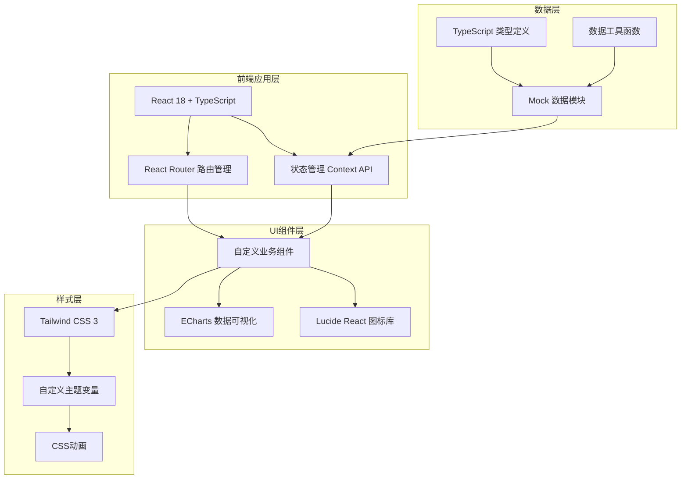
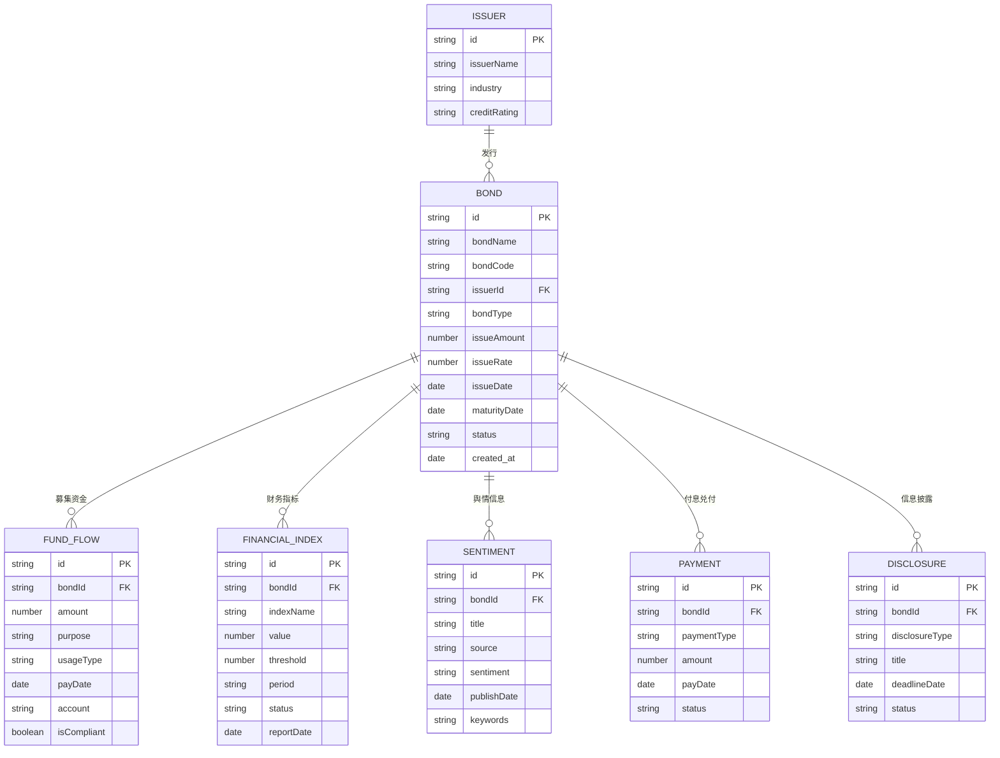

# 债券发行与存续期合规管理平台 技术架构

## 1. 架构设计

本项目为纯前端单页应用（SPA），所有数据使用内存Mock数据，不依赖后端服务和数据库。



## 2. 技术说明

- **前端框架**：React 18 + TypeScript
- **构建工具**：Vite 5
- **样式方案**：Tailwind CSS 3
- **路由管理**：React Router DOM v6
- **图表库**：ECharts 5 + echarts-for-react
- **图标库**：Lucide React
- **状态管理**：React Context API + useReducer
- **代码规范**：ESLint + TypeScript严格模式
- **数据存储**：纯前端Mock数据（无数据库、无后端）
- **代码注释**：所有组件和函数添加JSDoc注释
- **命名规范**：统一使用驼峰命名法（camelCase）

## 3. 路由定义

| 路由路径 | 页面名称 | 说明 |
|----------|----------|------|
| / | 工作台总览 | 数据看板、预警信息、待办事项 |
| /bonds | 债券项目列表 | 所有债券项目列表管理 |
| /bonds/:id | 债券项目详情 | 单个债券的详细信息和流程 |
| /funds | 募集资金追踪 | 资金到账、使用、监控 |
| /finance | 财务监控中心 | 财务指标、预警、趋势分析 |
| /sentiment | 舆情监控中心 | 舆情列表、情感分析、统计 |
| /duration | 存续期管理 | 付息兑付、信息披露、违约处置 |
| /reports | 合规报告中心 | 合规检查、报告生成 |

## 4. 数据模型定义

### 4.1 核心实体关系



### 4.2 项目目录结构

```
src/
├── assets/              # 静态资源
├── components/          # 通用组件
│   ├── common/         # 基础通用组件（Card、Table、Badge等）
│   ├── charts/         # 图表组件
│   └── layout/         # 布局组件（Sidebar、Header等）
├── pages/              # 页面组件
│   ├── Dashboard/      # 工作台
│   ├── BondList/       # 债券列表
│   ├── BondDetail/     # 债券详情
│   ├── FundTracking/   # 募集资金追踪
│   ├── FinanceMonitor/ # 财务监控
│   ├── Sentiment/      # 舆情监控
│   ├── Duration/       # 存续期管理
│   └── Reports/        # 合规报告
├── types/              # TypeScript类型定义
│   └── index.ts
├── mock/               # Mock数据
│   ├── bonds.ts
│   ├── funds.ts
│   ├── finance.ts
│   ├── sentiment.ts
│   └── reports.ts
├── context/            # Context状态管理
│   └── AppContext.tsx
├── utils/              # 工具函数
│   ├── formatters.ts   # 格式化工具（金额、日期等）
│   └── helpers.ts      # 辅助函数
├── hooks/              # 自定义Hooks
│   └── useStats.ts
├── App.tsx             # 根组件
├── main.tsx            # 入口文件
└── index.css           # 全局样式
```

## 5. 核心功能实现要点

1. **Mock数据设计**：
   - 使用TypeScript接口定义严格的数据结构
   - 创建逼真的模拟数据，包含不同状态的债券、财务指标、舆情数据
   - 数据覆盖完整的业务流程场景

2. **数据可视化**：
   - 使用ECharts实现折线图、柱状图、饼图、日历热力图
   - 仪表盘图表展示关键指标
   - 图表配色与整体设计风格统一

3. **状态管理**：
   - 使用Context API管理全局状态（当前选中债券、预警数据、用户权限）
   - 组件内部状态使用useState/useReducer

4. **交互体验**：
   - 实现标签页切换、模态框、筛选排序
   - 加载动画和过渡效果
   - 风险等级的颜色编码和视觉强调
