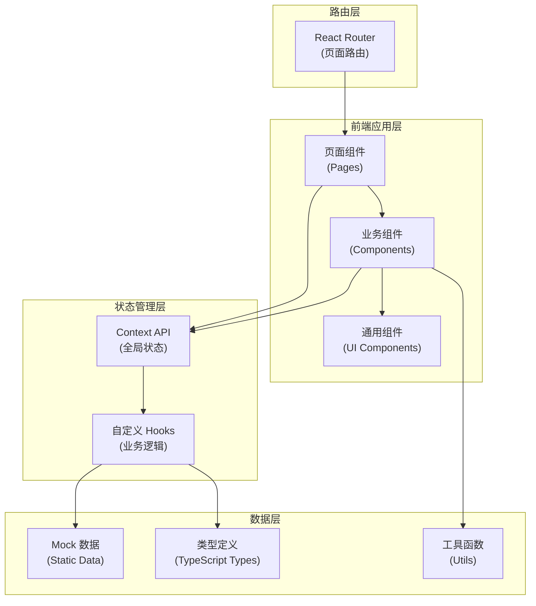
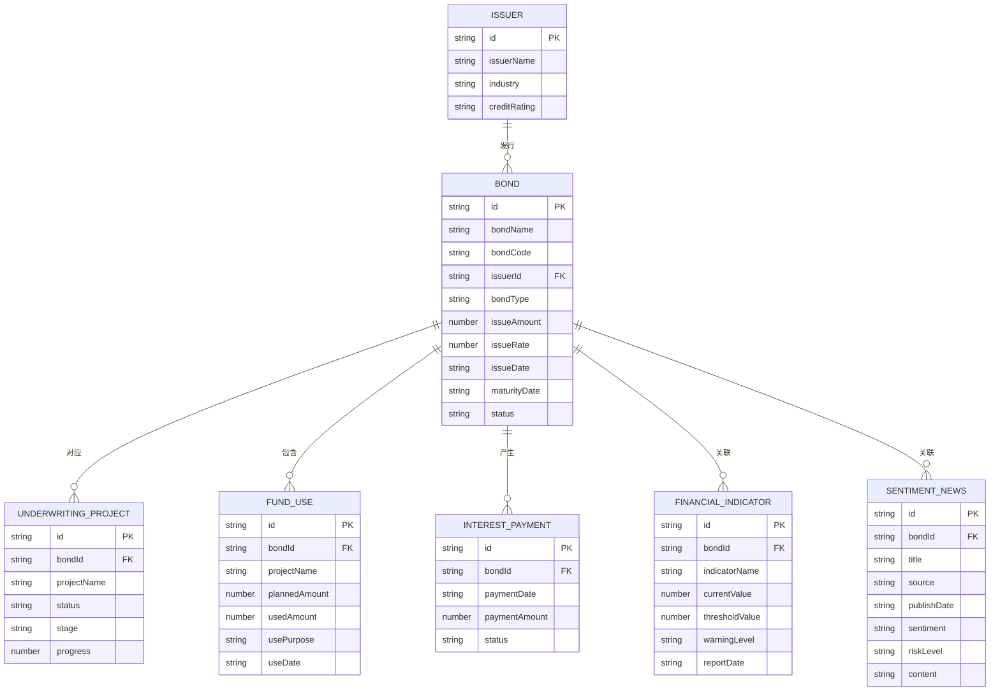

## 1. 架构设计



## 2. 技术说明

- **前端框架**：React 18 + TypeScript 5
- **构建工具**：Vite 5
- **样式方案**：Tailwind CSS 3
- **路由管理**：React Router DOM 6
- **图表库**：Recharts 2
- **图标库**：Lucide React
- **后端服务**：无（纯前端 Mock 数据）
- **数据库**：无（使用 TypeScript 静态数据模拟）
- **代码规范**：驼峰命名法，中文代码注释，ESLint 校验

## 3. 路由定义

| 路由路径 | 对应页面 | 功能说明 |
|----------|----------|----------|
| `/` | 工作台首页 | 数据看板、待办事项、风险预警概览 |
| `/underwriting` | 债券承销管理 | 承销项目列表页 |
| `/underwriting/:id` | 承销项目详情 | 单个承销项目详情页 |
| `/issuance` | 债券发行管理 | 发行中债券列表页 |
| `/issuance/:id` | 发行详情页 | 单个债券发行详情页 |
| `/duration` | 存续期管理 | 存续期债券列表页 |
| `/duration/:id` | 存续期详情 | 单个债券存续期详情页 |
| `/funds` | 募集资金追踪 | 资金总览与使用台账 |
| `/funds/:id` | 资金详情 | 单只债券募集资金详情 |
| `/finance` | 财务监控中心 | 财务指标监控与预警 |
| `/sentiment` | 舆情监控中心 | 舆情动态监控列表 |
| `/sentiment/:id` | 舆情详情 | 单条舆情详情页 |
| `/settings` | 系统设置 | 指标配置、预警规则 |

## 4. 核心数据模型

### 4.1 实体关系图



### 4.2 类型定义文件结构

```
src/
├── types/
│   ├── bond.ts          # 债券相关类型定义
│   ├── fund.ts          # 募集资金类型定义
│   ├── finance.ts       # 财务指标类型定义
│   ├── sentiment.ts     # 舆情类型定义
│   └── common.ts        # 通用类型定义
├── data/
│   ├── mockBonds.ts     # 债券模拟数据
│   ├── mockFunds.ts     # 资金模拟数据
│   ├── mockFinance.ts   # 财务模拟数据
│   └── mockSentiment.ts # 舆情模拟数据
├── components/
│   ├── Layout/          # 布局组件（导航、顶部栏）
│   ├── Dashboard/       # 首页看板组件
│   ├── BondList/        # 债券列表组件
│   ├── BondDetail/      # 债券详情组件
│   ├── FundTracker/     # 资金追踪组件
│   ├── FinanceMonitor/  # 财务监控组件
│   ├── Sentiment/       # 舆情监控组件
│   └── UI/              # 通用UI组件（卡片、表格、图表等）
├── pages/
│   ├── Dashboard.tsx
│   ├── Underwriting.tsx
│   ├── Issuance.tsx
│   ├── Duration.tsx
│   ├── FundTracker.tsx
│   ├── FinanceMonitor.tsx
│   ├── SentimentMonitor.tsx
│   └── Settings.tsx
├── hooks/
│   ├── useBonds.ts
│   ├── useFunds.ts
│   └── useWarnings.ts
├── utils/
│   ├── formatters.ts    # 数值、日期格式化
│   └── helpers.ts       # 辅助函数
├── App.tsx
├── main.tsx
└── index.css
```

## 5. 目录结构详细说明

- `src/types/`: TypeScript 类型定义，所有接口和类型集中管理
- `src/data/`: Mock 静态数据，模拟后端返回的数据结构
- `src/components/Layout/`: 页面布局组件，包含侧边导航、顶部状态栏
- `src/components/Dashboard/`: 首页专属组件（统计卡片、待办列表、预警列表）
- `src/components/BondList/`: 债券列表通用组件（筛选、表格、分页）
- `src/components/BondDetail/`: 债券详情通用组件（信息卡、时间线、记录列表）
- `src/components/UI/`: 原子化通用组件（Button、Card、Badge、Modal、Chart 容器等）
- `src/pages/`: 页面级组件，负责组装业务组件
- `src/hooks/`: 自定义 React Hooks，封装数据查询和业务逻辑
- `src/utils/`: 工具函数，负责格式化、计算等纯函数逻辑
