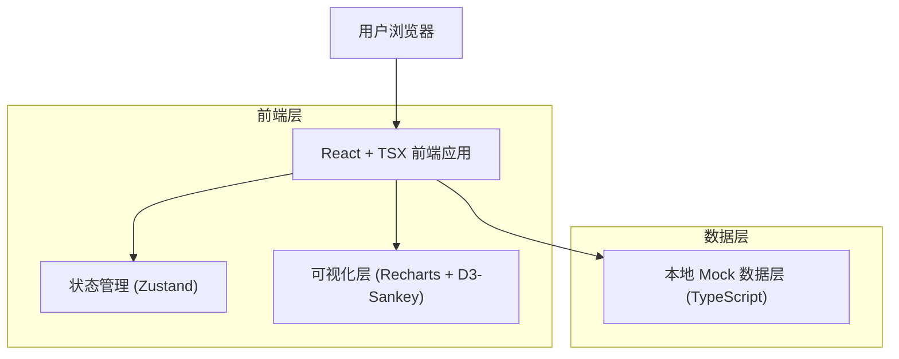
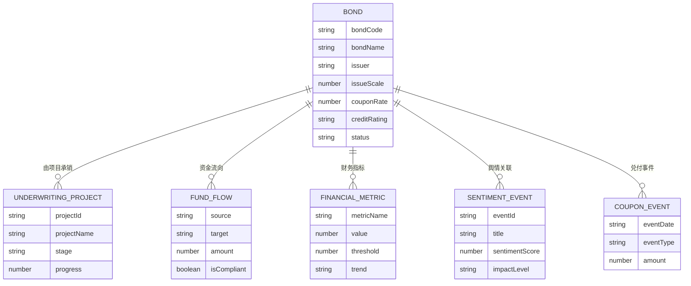

# 债券发行与存续期合规管理平台 - 技术架构文档

## 1. 架构设计



## 2. 技术描述
- 前端：React@18 + TypeScript@5 + Tailwindcss@3 + Vite@5
- 初始化工具：vite (react-ts 模板)
- 状态管理：Zustand
- 路由：React Router v6
- 图表：Recharts + d3-sankey
- 图标：lucide-react
- 动效：framer-motion
- 后端：无（纯前端 Mock）
- 数据库：无（使用 TypeScript 内嵌 Mock 数据，遵循驼峰命名）

## 3. 路由定义
| 路由 | 用途 |
|------|------|
| /              | 驾驶舱首页（核心 KPI、风险概览、待办流） |
| /underwriting  | 承销管理列表 |
| /underwriting/:projectId | 承销项目详情 |
| /issuance      | 发行管理（计划、簿记、结果） |
| /duration      | 存续期管理（台账与兑付日历） |
| /fund-tracking | 募集资金追踪（资金流向、用途合规） |
| /financial     | 财务指标监控（趋势、阈值告警） |
| /sentiment     | 舆情监测（瀑布流、事件详情） |

## 4. API 定义
不涉及后端 API。前端通过 `src/mock/*.ts` 模块导出强类型 Mock 数据，并由 Zustand store 统一管理。

核心数据类型示例：
```typescript
// 债券类型
interface BondInfo {
  bondCode: string;        // 债券代码
  bondName: string;        // 债券名称
  issuer: string;          // 发行人
  issueScale: number;      // 发行规模(亿元)
  couponRate: number;      // 票面利率
  creditRating: string;    // 信用评级
  issueDate: string;       // 发行日期
  maturityDate: string;    // 到期日期
  status: BondStatus;      // 状态
}

// 募集资金流向
interface FundFlowNode {
  source: string;          // 来源节点
  target: string;          // 目标节点
  amount: number;          // 金额
  isCompliant: boolean;    // 是否合规
}

// 舆情事件
interface SentimentEvent {
  eventId: string;         // 事件ID
  bondCode: string;        // 关联债券
  sentimentScore: number;  // 情感分(-1~1)
  impactLevel: 'low' | 'medium' | 'high';
  publishTime: string;     // 发布时间
  title: string;           // 标题
  summary: string;         // 摘要
}
```

## 5. 数据模型

### 5.1 数据模型定义（前端 TS 类型）



### 5.2 数据定义语言
不涉及数据库，所有数据以 TS Mock 形式存储于 `src/mock/` 目录下，命名遵循小驼峰：`bondList.ts`、`underwritingProjects.ts`、`fundFlows.ts`、`financialMetrics.ts`、`sentimentEvents.ts`、`couponSchedules.ts`。
